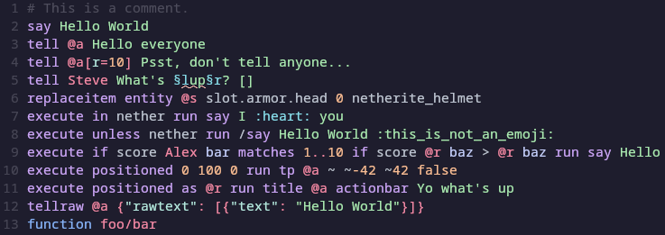

# tree-sitter-mcfunction

`mcfunction` grammar for [tree-sitter][].

<p align="center">
  
</p>

> [!IMPORTANT]
> This project is still in development. The installation process will be
> simplified as soon as the grammar is considered stable.

## Editor Integration

> [!TIP]
> For full compability, also make sure to have Tree-sitter grammar installed for
> JSON.

```sh
git clone https://github.com/phoenixr-codes/tree-sitter-mcfunction.git
cd tree-sitter-mcfunction
```

### Neovim

> [!NOTE]
> See also: <https://github.com/nvim-treesitter/nvim-treesitter?tab=readme-ov-file#adding-parsers>

```lua
local parsers = require("nvim-treesitter.parsers").get_parser_configs()

parsers.mcfunction = {
  install_info = {
    url = "https://github.com/phoenixr-codes/tree-sitter-mcfunction.git",
    files = { "src/parser.c" },
    branch = "main",
  },
}
```

```sh
mkdir -p ~/.config/nvim/queries/mcfunction
ln queries/*.scm ~/.config/nvim/queries/mcfunction
```

### Helix

> [!IMPORTANT]
> Because Helix does not support language version 15, you need to use the
> `helix` branch.

```toml
# ~/.config/helix/languages.toml

[[grammar]]
name = "mcfunction"
source = { git = "https://github.com/phoenixr-codes/tree-sitter-mcfunction", rev = "<LATEST COMMIT HASH OF `helix` BRANCH>" }

[[language]]
scope = "source.mcfunction"
name = "mcfunction"
file-types = ["mcfunction"]
roots = ["manifest.json"]
comment-token = "#"
```

```sh
hx --grammar fetch
hx --grammar build
mkdir -p ~/.config/helix/runtime/queries/mcfunction
ln queries/*.scm ~/.config/helix/runtime/queries/mcfunction
```

## References

- [Official list of commands and their syntax](https://github.com/MicrosoftDocs/minecraft-creator/tree/main/creator/Commands/commands)

[tree-sitter]: https://github.com/tree-sitter/tree-sitter
